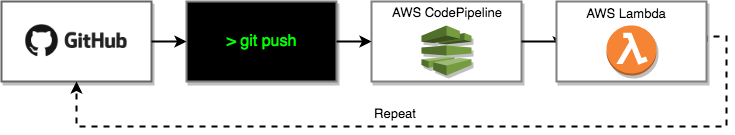

# Cookiecutter Template for AWS SAM Applications using GitOps patterns.

This is a [Cookiecutter](https://github.com/audreyr/cookiecutter) template to create a Serverless Application based on Serverless Application Model (SAM).

It is important to note that **you should not try** to `git clone` this project but use `cookiecutter` CLI instead as a new project will be rendered based on your input and therefore all variables and files will be rendered properly.

## Features

This template will generate a new application using **GitOps** Patterns. Once your project is generated you only need to install the application's Pipeline. 

The application Pipeline will:
- Manage your AWS Infrastructure (Infrastructure as Code)  
- Deploy your application (Continuous Deployments). AWS CodeDeploy will be used to deploy your lambda's with a **Canara Release strategy**. The release strategy can be fine-tuned to better suit your needs.
- Generate your API docs (Swagger)



## Getting Started

### Prerequisites

- Git
- AWS CLI
- make tools
- Python 3.6
- Cookiecutter
- Pipenv

### Installation

#### OS X
- [Get Python 3.6](https://www.python.org/downloads/release/python-360/)
- `pip3 install cookiecutter`
- `pip3 install pipenv`


#### Windows

For make and other Unix Utilities, you can download [unxUtils.1.0.0.1.nupkg](https://artifactory.persgroep.cloud/artifactory/ext-release-local/org/chocolatey/UnxUtils/1.0.0.1/unxUtils.1.0.0.1.nupkg)

On Windows, with [chocolatey](https://chocolatey.org) and [sudo](https://chocolatey.org/packages/sudo) installed:

```
sudo choco install python
sudo choco install awscli
sudo choco install unxUtils.1.0.0.1.nupkg
pip install cookiecutter
pip install pipenv
```


**NOTE**: [`Pipenv`](https://github.com/pypa/pipenv) is the new and recommended Python packaging tool that works across multiple platforms and makes Windows a first-class citizen.

## Usage

Generate a new SAM based Serverless App: `cookiecutter gh:glnds/cookiecutter-aws-sam-python`. 

You'll be prompted a few questions to help this cookiecutter template to scaffold this project and after its completed you should see a new folder at your current path with the name of the project you gave as input.

**NOTE**: After you understand how cookiecutter works (cookiecutter.json, mainly), you can fork this repo and apply your own mechanisms to accelerate your development process and this can be followed for any programming language and OS.


# Credits

* This project has been generated with [Cookiecutter](https://github.com/audreyr/cookiecutter)
* [Forked from aws-samples](https://github.com/aws-samples/cookiecutter-aws-sam-python)


License
-------

This project is licensed under the terms of the [MIT License with no attribution](/LICENSE)
